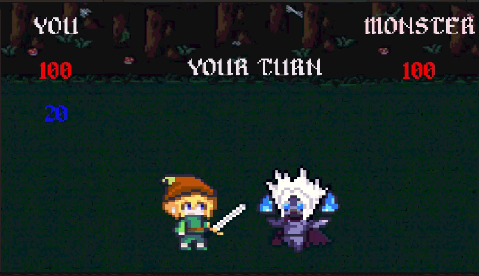
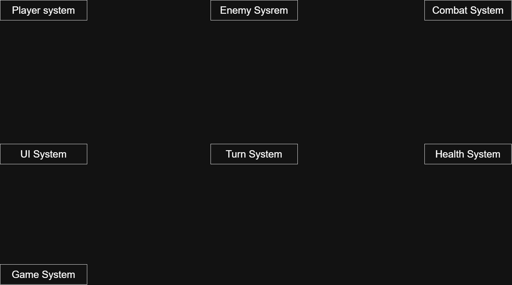

# 🎮 RPG Simulator

  

---

# 📖 About the Game

**RPG Simulator** is a 2D RPG game where players must defeat enemies by using available roles in the game.

---

# 🎮 Gameplay

The player takes control of a character and must defeat the enemy through turn-based RPG gameplay.

Players can use the available role and its abilities to deal damage and overcome the enemy.

The game focuses on simple RPG mechanics.

---

# 👥 Team

| Name | Role |
|---|---|
| Christopher Immanuel Sunjoto | Programmer, Designer |

### My Contribution

- Developed the game systems
- Implemented gameplay mechanics
- Implemented player and enemy systems
- Designed gameplay features
- Implemented UI functionality
- Implemented assets from itch io

---

# ✨ Features

- RPG Turnbase gameplay
---

# ⚙️ Module Design

  

---

# ⚙️ Module and Features

| Module | Features | Description |
|---|---|---|
| **Player System** | Movement, Input | Handles player input and player actions |
| **Enemy System** | Enemy Behaviour | Handles enemy behaviour and actions |
| **Combat System** | Attack, Damage | Handles combat interactions between player and enemy |
| **Turn System** | Turn Management | Handles player and enemy turns |
| **Health System** | HP | Handles player and enemy health |
| **UI System** | HUD, UI | Displays gameplay information such as HP and turn information |
| **Game System** | Game Flow | Handles the overall game progression |
| **Audio System**      | BGM, SFX           | Manages background music and sound effects                               |
| **Scene Management**  | Scene Transitions  | Handles navigation between the main menu, gameplay, and game-over scenes |

---

# 📁 Game Flow

  

---

# 🛠️ Development

**Engine:** Unity  
**Programming Language:** C#  
**Genre:** RPG · Action · 2D

---

# 💻 My Role

As a **Programmer and Designer**, I was responsible for developing the gameplay systems and designing several gameplay features.

### Programming Responsibilities

- Player system
- Enemy system
- Combat system
- Turn system
- Health system
- UI functionality
- Game flow

### Design Responsibilities

- Gameplay mechanics
- Combat flow
- Game rules
